Banco de Dados: Preparando o Ambiente
=====================================

Configuração do ambiente local
------------------------------

Neste tópico faremos toda a configuração necessária na sua máquina para que possamos avançar com os conteúdos e entender cada vez mais sobre bancos de dados. Sendo assim, utilizaremos o banco de dados **PostgreSQL**, que é muito utilizado e, além disso, é gratuito.

Instalação do servidor
----------------------

Em primeiro lugar, precisaremos acessar o site de downloads do PostgreSQL: [PostgreSQL: Downloads](https://www.postgresql.org/download/)

Podemos acessar também direto pelo link dos instaladores, neste caso: [Download PostgreSQL](https://www.enterprisedb.com/downloads/postgres-postgresql-downloads)

Neste momento, através do site de download dos instaladores, vamos escolher a versão de instalação 14.2 como sendo a opção de instalação correta para o seu sistema operacional.

Grande parte das pessoas utilizam Windows com distribuição x64, dessa forma, podemos escolher o instalador com a descrição **Windows x86-64**. Para Apple você deve escolher a opção **Mac OS X**.

**Figura 1** – Passo 1 | Instalação do servidor (Fonte da imagem: do autor)

Assim que o download do instalador for concluído, execute e siga as etapas como instruído abaixo.

Agora que executamos o instalador, nessa primeira etapa da instalação vamos apenas clicar na opção **Next**.

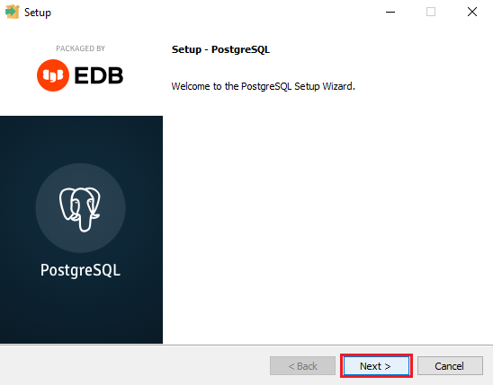

**Figura 2** – Passo 2 | Instalação do servidor (Fonte da imagem: do autor)

Nesta segunda etapa, é exibido pelo instalador o caminho onde serão armazenados os arquivos de instalação do servidor. Neste caso, o ideal é manter o diretório padrão que já vem preenchido e apenas clicar em **Next**. Porém, se você desejar instalar em outro diretório, poderá clicar na pastinha ao lado de onde é exibido o caminho e basta selecionar o diretório novo em que você deseja fazer a instalação.

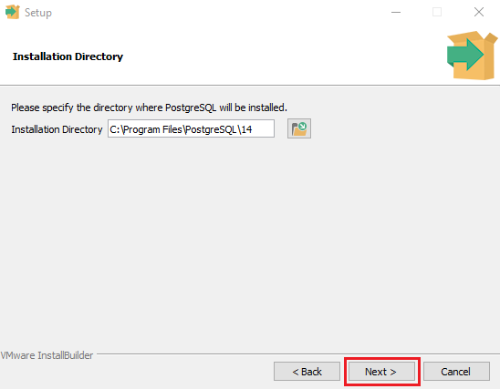

**Figura 3** – Passo 3 | Instalação do servidor (Fonte da imagem: do autor)

Nesta terceira etapa, serão exibidos pelo instalador algumas opções que são os "Componentes", ou seja, utilidades ou softwares que complementam a utilização do servidor. Neste caso vamos precisar apenas dos componentes nomeados como **PostgreSQL Server**, **pgAdmin 4** e **Command Line Tools**. Por padrão, 4 opções já aparecem selecionadas, então você só precisará desmarcar a opção **Stack Builder** e clicar em **Next**.

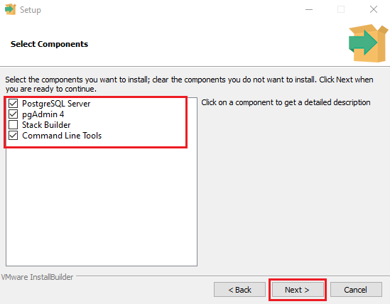

**Figura 4** – Passo 4 | Instalação do servidor (Fonte da imagem: do autor)

Na quarta etapa, é exibido o diretório em que serão armazenados os dados que o servidor precisa para funcionar corretamente e os dados que vamos criar ao longo do módulo. Manteremos o diretório padrão que já vem preenchido e vamos clicar em **Next**.

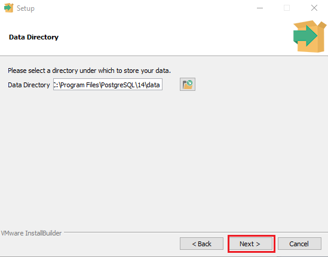

**Figura 5** – Passo 5 | Instalação do servidor (Fonte da imagem: do autor)

Na quinta etapa precisamos prestar bastante atenção e guardar as informações que vamos preencher, pois, o instalador está solicitando uma senha que utilizaremos depois para podermos nos comunicar com o servidor do banco de dados. Então, preencha com uma senha que você se lembrará posteriormente nos 2 campos e clique em **Next**.

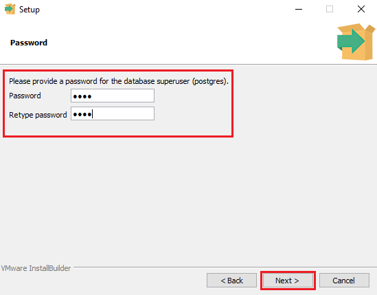

**Figura 6** – Passo 6 | Instalação do servidor (Fonte da imagem: do autor)

Na sexta etapa, é exibido a porta padrão que o servidor utilizará para ficar rodando automaticamente toda vez que o computador ligar, então, neste caso, devemos manter a porta padrão que é 5432 e clicar em **Next**.

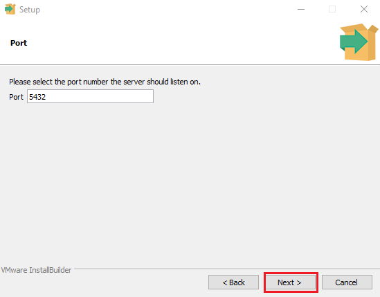

**Figura 7** – Passo 7 | Instalação do servidor (Fonte da imagem: do autor)

Na sétima etapa devemos apenas clicar em **Next** mantendo o valor padrão selecionado pelo instalador.

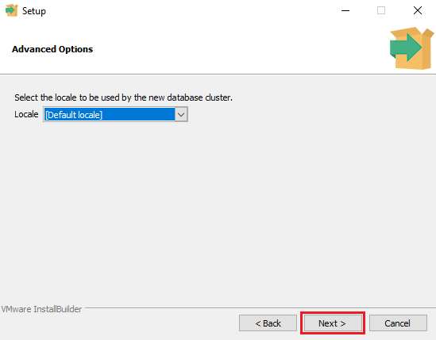

**Figura 8** – Passo 8 | Instalação do servidor (Fonte da imagem: do autor)

Na oitava etapa é exibido um resumo do que o instalador tem definido, devemos apenas clicar em **Next**.

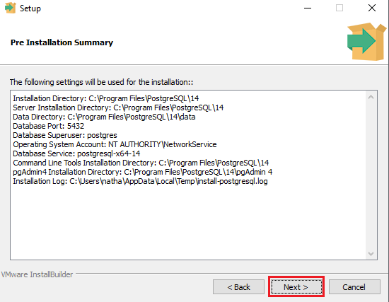

**Figura 9** – Passo 9 | Instalação do servidor (Fonte da imagem: do autor)

Na nona etapa devemos apenas clicar em **Next**.

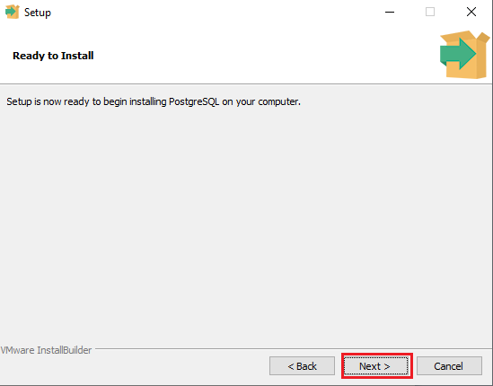

**Figura 10** – Passo 10 | Instalação do servidor (Fonte da imagem: do autor)

A décima e última etapa é apenas o instalador exibindo que a instalação foi concluída com sucesso, clique na opção **Finish**

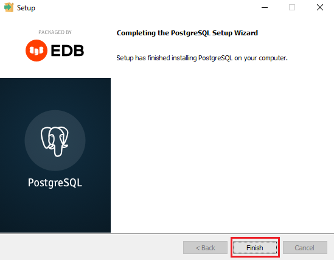

**Figura 11** – Instalação completa (Fonte da imagem: do autor)

Instalação do cliente
---------------------

Para nos comunicarmos e conseguirmos realizar o gerenciamento do servidor de banco de dados, devemos instalar o que chamamos de SGBD, que é a sigla para sistema gerenciador de banco de dados.

É um tipo de software que tem o papel de auxiliar no envio dos comandos SQL para o servidor de banco de dados e no gerenciamento dos servidores, exibindo informações úteis como: estruturas dos bancos de dados que estamos criando através dos comandos SQL, quantidade de tabelas e dados das tabelas entre diversas utilidades que nos são disponibilizadas por eles.

Para este módulo utilizaremos um SGBD chamado DBeaver, que tem inteligência para se comunicar com diversos servidores, como por exemplo: mysql, mssql, mariadb, oracle etc. Então, é um ótimo candidato para aprendermos a utilizar ao longo do módulo, temos diversos outros SGBDS, como por exemplo o pgAdmin, o mysql e o workbench.

Vamos começar acessando o site com as opções de download do DBeaver através do link: [Download &#124; DBeaver Community](https://dbeaver.io/download/)

Selecione a opção de download do instalador para o seu sistema operacional, como a maioria é windows, podemos selecionar a primeira opção nomeada como **Windows (installer)**

**Figura 12** – Passo 1 | Instalação do DBeaver(Fonte da imagem: do autor)

Após realizar o download, execute o instalador e na primeira etapa será exibida uma caixinha indicando qual linguagem o DBeaver será instalado. No caso, como estamos no brasil, a seleção trará como padrão o idioma em **português**, então só clique no botão **OK**.

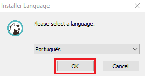

**Figura 13** – Passo 2 | Instalação do DBeaver(Fonte da imagem: do autor)

Nesta segunda etapa, o instalador fará uma introdução com dicas do que fazer para uma instalação mais efetiva, neste caso leia e clique no botão **Seguinte**.

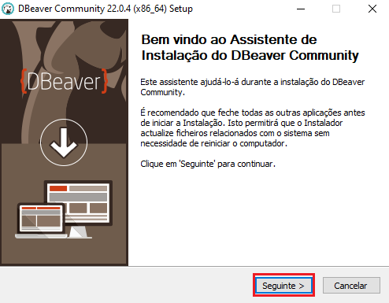

**Figura 14** – Passo 3 | Instalação do DBeaver(Fonte da imagem: do autor)

Na terceira etapa será exibido o contrato de licença (Termos de uso), leia e clique em **Aceito**.

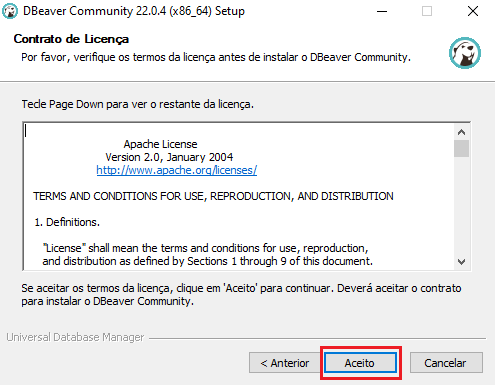

**Figura 15** – Passo 4 | Instalação do DBeaver(Fonte da imagem: do autor)

Na quarta etapa, o instalador perguntará para quais usuários você deseja instalar o DBeaver, no nosso caso podemos manter a opção padrão que será **For me** e clique em **Seguinte**.

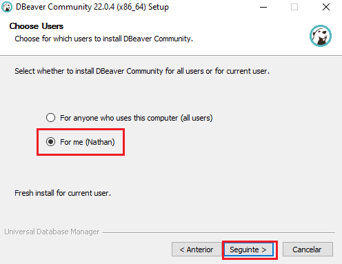

**Figura 16** – Passo 5 | Instalação do DBeaver(Fonte da imagem: do autor)

Na quinta etapa o instalador exibirá os componentes que serão instalados, por padrão virá os 2 primeiros selecionados, mantenha-os e clique em **Seguinte**.

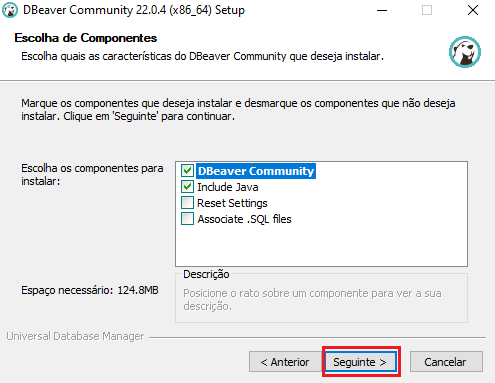

**Figura 17** – Passo 6 | Instalação do DBeaver(Fonte da imagem: do autor)

Na sexta etapa o instalador perguntará qual diretório você deseja instalar o DBeaver, vamos manter o padrão e clicar em **Seguinte**.

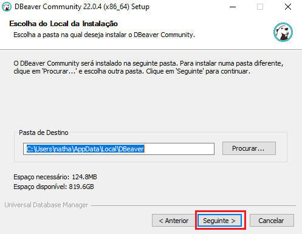

**Figura 18** – Passo 7 | Instalação do DBeaver(Fonte da imagem: do autor)

Na sétima etapa vamos apenas clicar em **Instalar**.

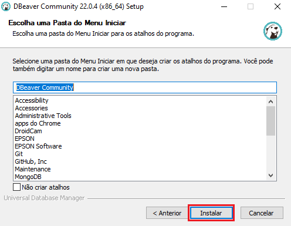

**Figura 19** – Passo 8 | Instalação do DBeaver(Fonte da imagem: do autor)

Após isso vamos clicar na opção **Terminar**.

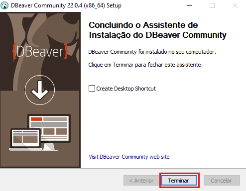

**Figura 20** – Passo 9 | Instalação do DBeaver(Fonte da imagem: do autor)

Conexão do SGBD com o servidor
------------------------------

Após realizar a instalação tanto do servidor quanto do SGBD, vamos abrir o DBeaver.

Ao abrir o DBeaver pela primeira vez, vamos nos deparar com uma mensagem perguntando se queremos criar um banco de dados de exemplo, vamos clicar na opção **No**.

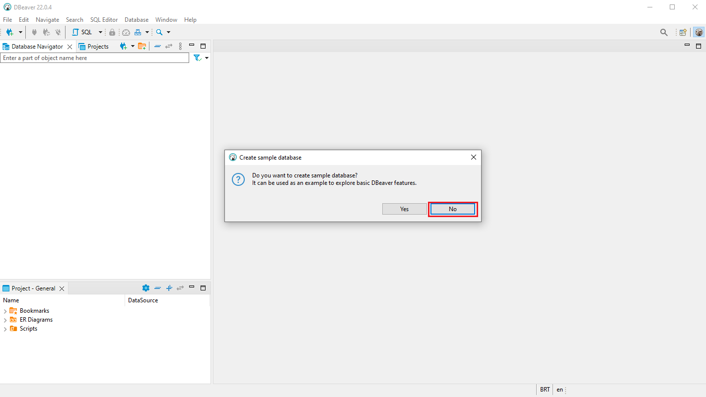

**Figura 21** – Passo 1 | Conectando o SGBD com o servidor(Fonte da imagem: do autor)

Após isso, aparecerá uma caixa com as opções mais populares de conexão com servidores de bancos de dados, no nosso caso queremos nos conectar ao PostgreSQL, que tem o símbolo de um elefante. Vamos selecionar ele e clicar na opção **Next**.

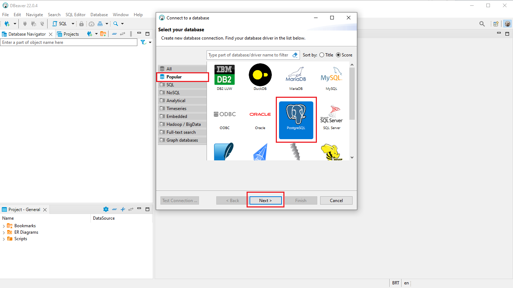

**Figura 22** – Passo 2 | Conectando o SGBD com o servidor(Fonte da imagem: do autor)

Após clicar em next, o DBeaver vai detectar que precisamos instalar alguns drivers para podermos fazer a conexão com o servidor de banco de dados PostgreSQL, então vamos clicar na opção **Download**.

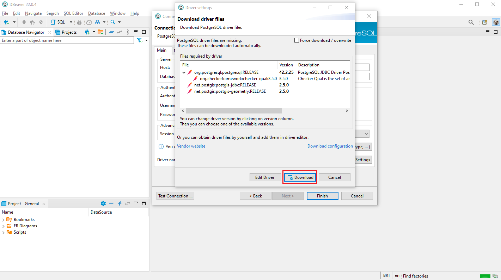

**Figura 23** – Passo 3 | Conectando o SGBD com o servidor(Fonte da imagem: do autor)

Feito o download, aparecerá a próxima tela em que colocaremos as informações para conexão com o servidor. Vamos entender o que é cada campo.

Na caixinha Server, podemos notar o campo **Host** em que está preenchido com o valor **localhost**, manteremos como o padrão o que já está preenchido, pois, queremos fazer uma conexão com um servidor que está na sua máquina.

Podemos notar também o campo **Port** que já veio preenchido com o valor 5432 e é a porta padrão do PostgreSQL, vamos manter como está. E, por último, podemos notar o campo **Database**, que está preenchido com o valor padrão **postgres**, manteremos assim também, pois é o database que possui as informações de conexão com o banco que preenchemos no momento da instalação.

Na caixinha Authentication, podemos notar que o campo **Authentication** já vem com o **Database Native** selecionado, não mudaremos nada, pois, é o método de autenticação que faremos a todo momento. Podemos notar também que o campo **Username** vem preenchido como **postgres** e não mudaremos.

Por último, vamos ter o campo **Password**, que precisa ser preenchido com uma senha, neste caso a senha que você colocará é a que foi definida no momento da instalação do servidor.

Então, podemos concluir que o único campo que precisou de modificação foi o de **Password**, mantendo assim os outros como o padrão que o SGBD já nos facilita exibindo-os.

Após preencher a senha, devemos alterar uma última coisa. Vamos para a aba **PostgreSQL** que se encontra ao lado da aba **Main** e vamos selecionar a opção **Show all databases**.

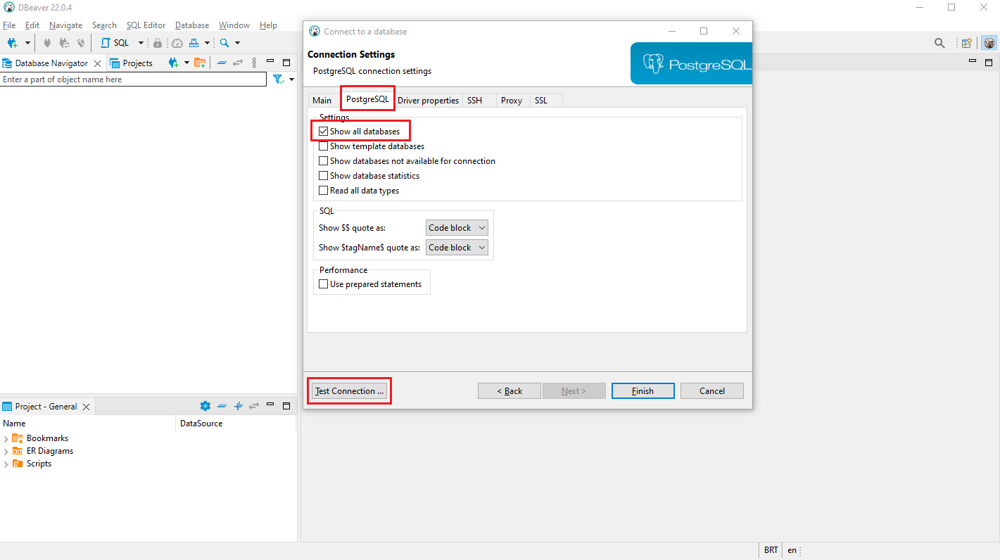

**Figura 24** – Passo 4 | Conectando o SGBD com o servidor(Fonte da imagem: do autor)

Após as alterações, vamos clicar no botão **Test Connection** que deve gerar o resultado como mostrado na imagem abaixo.

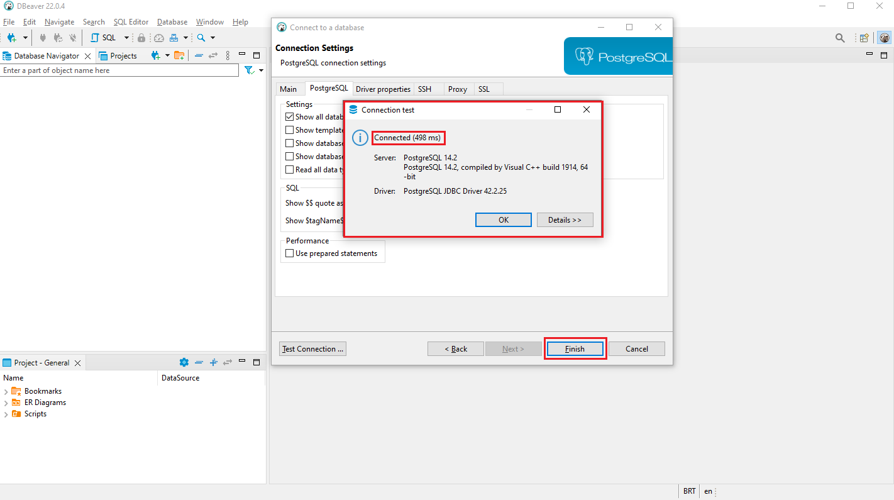

**Figura 25** – Passo 5 | Conectando o SGBD com o servidor(Fonte da imagem: do autor)

Após aparecer a mensagem **Connected** como mostra na imagem acima, podemos clicar no botão **Finish**, criando assim a nossa primeira conexão.

Referências e indicações
------------------------

[Download PostgreSQL](https://www.enterprisedb.com/downloads/postgres-postgresql-downloads). Enterprisedb, 2022. Acesso em: 30/06/2022.

[Download DBeaver](https://dbeaver.io/download/). DBeaver Community , 2022. Acesso em: 30/06/2022.

PINHO, Diego. [Administre seus bancos de dados com o DBeaver](https://imasters.com.br/banco-de-dados/administre-seus-bancos-de-dados-com-o-dbeaver). iMasters, 2018. Acesso em: 30/06/2022.

[Como utilizar o DBeaver?](https://baiadoconhecimento.com/biblioteca/conhecimento/read/397425-como-utilizar-o-dbeaver). Baia do conhecimento , 2021. Acesso em: 30/06/2022.

[O que é o PostgreSQL](https://www.postgresql.org/about/). Postgresql, 2022. Acesso em: 30/06/2022.

[O que é o PostgreSQL](https://azure.microsoft.com/pt-br/overview/what-is-postgresql/). Azure Microsoft, 2022. Acesso em: 30/06/2022.