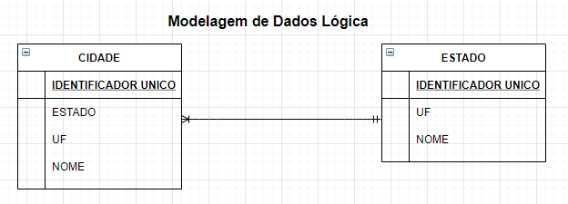
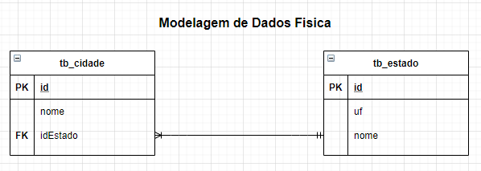

Introdução a Modelagem de Dados
===============================

**"Modelagem de dados é o ato de explorar estruturas orientadas a dados."**

Utilizamos **Modelagem de Dados** para:

Representar o ambiente observado;  
Fornecer processos de validação;  
Observar processos de relacionamentos entre objetos;  
Documentar.

É importante entender sobre:

**Entidade**  
Define qualquer coisa que seja identificável, singular e tenha existência bem delimitada, tais como _cidade_ e _estado_.

**Atributo**  
É tudo aquilo que pode relacionar como propriedade da entidade, tais como _nome da cidade_, _unidade federativa do estado_, etc.

**Relacionamento**  
Descreve um evento significativo que ocorre entre duas entidades.

**Cardinalidade**  
Conceito usado para dizer quantas vezes uma entidade pode se relacionar com outra entidade, também referenciado como “grau de relacionamento”.

Modelagem de Dados Conceitual
=============================

A modelagem de dados conceitual é utilizada para envolver o cliente, pois o foco aqui é discutir os aspectos do negócio do cliente. Os exemplos de modelagem de dados vistos pelo modelo conceitual são mais fáceis de compreender, já que não há limitações ou aplicação de tecnologia específica.

Aqui construimos o diagrama de **Entidade** e **Relacionamento**, onde são identificados todas as entidades e os relacionamentos entre elas. Este diagrama é a chave para a compreensão do modelo conceitual de dados.

Modelagem de Dados Lógica
=========================

A modelagem lógica implementa recursos como adequação de padrão e nomenclatura, define as chaves primárias e estrangeiras, normalização, integridade referencial, entre outras. O modelo lógico deve ser criado levando em conta os exemplos de modelagem de dados criados no modelo conceitual.

Modelagem de Dados Física
=========================

A modelagem física lida com o design do banco de dados real com base nos requisitos reunidos durante a modelagem lógica.

Tabela comparativa das modelagens
---------------------------------

| Caracteristica               | Conceitual | Logica | Fisica |
| ---------------------------- | ---------- | ------ | ------ |
| Nome de Entidades            | x          | x      |        |
| Relacionamentos de Entidades | x          | x      |        |
| Atributos                    | x          | x      |        |
| Chave Primária (PK)          |            | x      | x      |
| Chave Estrangeira (FK)       |            | x      | x      |
| Nome das Tabelas             |            |        | x      |
| Nome das Colunas             |            |        | x      |
| Tipo das Colunas             |            |        | x      |

Criação do Database
-------------------

    /*Estrutura do database bd_cidades_estados*/
    
    CREATE DATABASE bd_cidades_estados;

Criação das Tabelas
-------------------

    /*Estrutura da tabela tb_cidades*/
    
    CREATE TABLE tb_cidades (
        id SERIAL,
        nome VARCHAR(50) NOT NULL,
        idEstado INT NOT NULL,
        PRIMARY KEY (id),
        FOREIGN KEY (idEstado) REFERENCES tb_estados (id)
    );
    
    /*Estrutura da tabela tb_estados*/
    
    CREATE TABLE tb_estados (
        id SERIAL,
        uf VARCHAR(2) NOT NULL,
        nome VARCHAR(50) NOT NULL,
        PRIMARY KEY (id)
    );

Inserção de Registros
---------------------

1- Realizar download dos arquivo [scripts_tb_cidades](https://s3-sa-east-1.amazonaws.com/lcpi/03c30c81-a820-4b3f-a342-fb3810062acf.sql) e [script_tb_estados.sql](https://s3-sa-east-1.amazonaws.com/lcpi/6cbe1fdf-68bc-4f58-9db3-cb83da93e464.sql)

2- Executar no database **bd_cidades_estados**.
